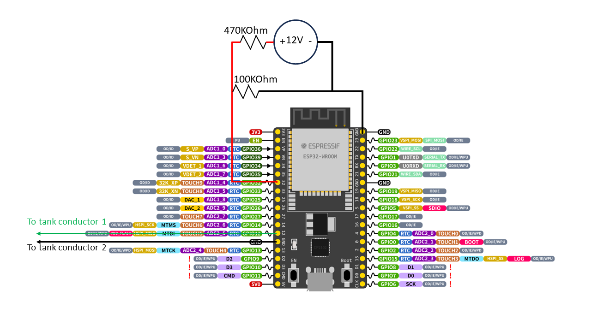

# rvmeter-server

ESP32 based BLE server to transmit 12V voltage and capacitance measurements of the water levels in an RV.

The client side implementation is an open source Flutter based application rvmeter-client.

## Quick start

Copy or move all directories in the folder to <C:\Users\Your User Name\Documents\Arduino\libraries>

Build and Upload the sketch

## Hardware Design

### Water Level Sensor

The water level sensor uses the capacitance touch sensor on the ESP32.

If you have a plastic water tank, you can tape 2 conductors to the outside of the tank approximately 4 inches apart.  One conductor will go to a touch input and one conductor will go to a ground connection on the ESP32.

For a metal water tank, insulated conductors can be placed inside the water tank.

The change in water level will change the capacitance measurements.

The the Touch characteristic value is set to the raw capacitance measurement.

### Voltage Sensor

The voltage is read using one of the analog pins of the ESP32.

A voltage divider consisting of a 470KOhm resistor and a 100KOhm resistor divides the voltage from the 12V battery by 5.7.

Note that the 12V ground must be attached to one of the ground pins on the ESP32.

### Wiring Diagram

## BLE Communication

The BLE Server name is "RV Server".  This can be changed by updating `SERVER_NAME` in the defines section.

The BLE `SERVICE_UUID` is set to "68f9860f-4946-4031-8107-9327cd9f92ca".

The touch sensor reading uses the Touch charactistic with the `TOUCH_CHARACTERISTIC_UUID` set to "bcdd0001-b67f-46c7-b2b8-e8a385ac70fc".

The voltage sensor reading uses the Voltage charactistic with the `VOLTAGE_CHARACTERISTIC_UUID` set to "bcdd0002-b67f-46c7-b2b8-e8a385ac70fc".
